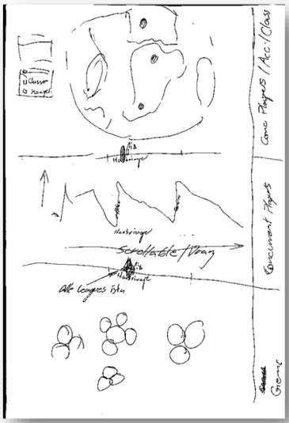

# ivis-poe

# General Project Information

This project is part of an assignment of the ivis (information visualization) class. The idea is to represent the Path of Exile player base's choices, locations, and various other data in an intuitive and visually pleasing way.
This project does **not** use actual player data since there are only current data and no history of past leagues. The data is instead generated using [mockaroo](https://mockaroo.com/) with the goal of trying to be as realistic as possible. We, for example, take into account that the majority of the playerbase is male rather than female among other variables. The idea here is to not have fully randomized data, but rather randomized data that seems to make sense in the context of this project.

It is also important to know that the way this project is built might change in the future. Right now, the web project requires a local python webserver to run, which is not intuitive at all but makes sense for development reasons.


# How we choose this Visualization & Interaction
### Overview
With our visualization we want to tell a story and guide the user through the data, using different depths of the data.
 
At first we show a **Stacked-Bar-Chart** for an overview about all players who play in each League. Our first approach was 
to use a line-Chart but we needed to display more different data than just one column. 
We choose the Stacked-Bar-Chart to visualize parts of a whole.
If the user want more detail about the orientation of players he can have a look in our second diagram, the globe.

**The globe** shows all players of each League and their location. At least the user get a look about each classes 
and their skills in our **bubble diagram** to show the correlations.

####We used Bertin's Visual Variables to define our visualizations
in our **Stacked-bar-chart** we use the Variable "size" to show the number of used classes 
and value to divide the individual classes.
With these visual variables we can guarantee that the user can understand the data.

in our **Globe Diagram** we only use value to show the number of players per country. 
This should be enough to understand quickly the visualization.

and finally in our **Bubble Diagram** we use 
three variables to visualize the data. First we use the position to separate the classes from each other. 
We support this with different colors. And at last we use the size of the bubbles to visualize the number of used skills per class.


### Color
With the selected visualizations in mind, we decided on the "color saturation" variant, 
since "color hue" does not follow a natural sequence. 
In the Globe as well as in the stacked-bar chart we decided to use color saturation furthermore 
we also use the colour as a highlight for our interaction.

###### Why did we choose blue saturation and yellow highlights?
We oriented towards the game. The 3 main stats in Path of Exile are: 

 blue = intelligence
 
 red = strength
 
 green = dexterity
 
As we learned in class is green and red one of the most common visual impairment. 
That is why we choose blue as our base color. Furthermore is yellow(holy) a common property of many skills in the game.


# How we achieved our goal
At first we did a rough concept about how we want to visualize our data.
Then we analyse our rough idea with real visualization and interaction concept. After that we did a concept of our generated data.
While implementing our visualization we quickly realised that our generated data isn't realistic so we had to update our data with python and pandas (beautiful soup).
we switched then to different approaches because of unrealistic data for example we use countries instead of Longnitude and Lagnitudes
as we got point in the ocean. In the last step we had problems because of different d3.js Versions 


# How our "Game Population Analysis" works
**Stacked-Bar-Chart:**
the user can sort the diagram by clicking on the **Sort by** selection and choose either one of the classes, leagues overtime (timeline) or count the players of all classes.
he can furthermore **click** on each class to get a detailed listing of the information

**Globe diagram:**
there is a pull-effect, where the user can pull a country to get a better view on other countries. 
In addition we created a hover-effect thus the user see the name of the selected country.
if the user clicks on one country he gets a list of detailed Data like League, Country and the corresponding number of players.
Last but not least there is a range-slider so the user can navigate through all Leagues to see the differencies between them

**Bubble diagram:**
to get some fun in our IVIS-Pro project we also tried to create a gamification-effect. We achieved this by the pull-effect in the bubble display.
however, in order to obtain more precise data, the user can activate detailed information through the click effect.
As in the globe diagram, the user can change the league by changing the range slider to see filtered data


# Path of Exile Player Data Over Time
This project is in the form of a static HTML project, however as d3js requires a certain backend to function properly, a local python server is recommended.


# Python Server
**To run the python server, follow these steps:**

1. Run a command window / terminal / powershell, keep this open while using the website
2. Navigate to the folder where the index.html file is located at
3. - Python 3
		- enter command
		```
		python -m http.server
		```
	- Python 2 and lower
		- enter command
		```
		python -m SimpleHTTPServer
		```
4. **Leave this window open**
5. To open the website, type the following line in the URL window of your browser
```
localhost:8000/index.html
```
6. *Optional*:
	- the python server listens to port 8000 by default, you can change this by appending "portnumber &" to the command
		- an example of this would be ```python -m http.server 8080 &```
		- **please note** that this also requires you to use the respective port for the localhost address from Step 5. ```localhost:8080/index.html``` in this example.


